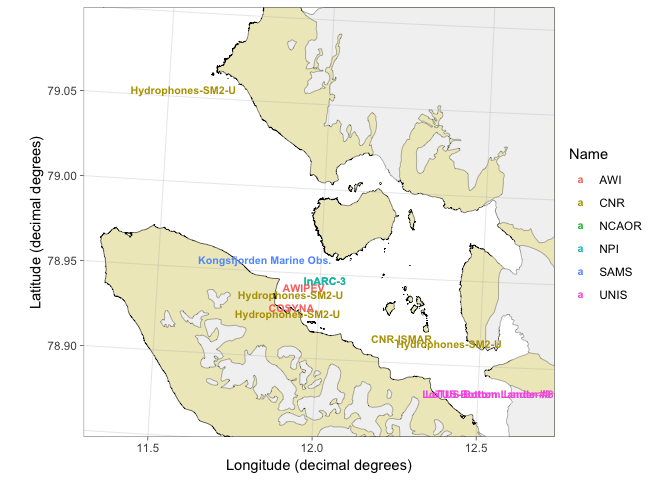
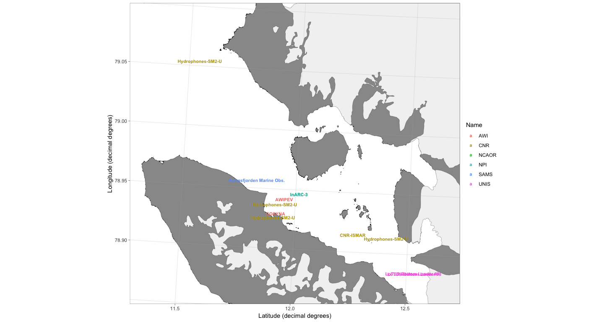

**Plot research data from Svalbard on maps**

This is a developmental version of the **PlotSvalbard** package providing functions to plot research data from Svalbard on detailed and up-to-date maps that are not available in online databases. The package is developed by the Norwegian Polar Institute. Glacier fronts and land shapes of Kongsfjorden originate from July 2017.

As the package is in an early developmental phase, functions might not work as intended. Note that the package comes with absolutely no warranty and that maps generated by the package might be wrong. Any bug reports and code fixes are warmly welcomed. See *Contributions and contact information* for further details.

**PlotSvalbard** is based on [**ggplot2**](http://ggplot2.tidyverse.org/reference/) and the functions can be expanded using ggplot syntax.

Installation of the GitHub version
-------
Using the [**devtools**](https://cran.r-project.org/web/packages/devtools/index.html) package:


```r
library(devtools)
install_github("MikkoVihtakari/PlotSvalbard", dependencies = TRUE)
```

Usage
-------
**PlotSvalbard** extends on [**ggplot2**](http://ggplot2.tidyverse.org/reference/). Data that contains geographic information can be plotted on these maps using the ggplot2 layers separated by the `+` operator.

### Website

PlotSvalbard has a [website](https://mikkovihtakari.github.io/PlotSvalbard/index.html), which is updated together with each major release.

### Function reference

[An organized list of functions](https://mikkovihtakari.github.io/PlotSvalbard/reference/index.html) included in the package can be found from the website.

### User manual

Detailed information on how to use the package can be found from [the user manual](https://mikkovihtakari.github.io/PlotSvalbard/articles/PlotSvalbard_user_manual.html) 

### Making a map with text


```r
library(PlotSvalbard)

data("kongsfjord_moorings")

basemap("kongsfjorden", limits = c(11.3, 12.69, 78.86, 79.1), round.lat = 0.05, round.lon = 0.5) + 
geom_text(data = kongsfjord_moorings,
  aes(x = lon.utm, y = lat.utm, label = Mooring.name, color = Name), 
  fontface = 2, size = 25.4/72.27*8) # font size = 8, see Graphical parameters
```

<!-- -->

### Combining extensions for ggplot2

Most extensions for ggplot2 work together with PlotSvalbard.


```r
data(zooplankton)

x <- transform_coord(zooplankton, lon = "Longitude", lat = "Latitude", bind = TRUE)

species <- colnames(x)[!colnames(x) %in% c("lon.utm", "lat.utm", "ID", "Longitude", "Latitude", "Total")]

library(scatterpie)

basemap("barentssea", limits = c(4, 24, 79.5, 83.5), round.lon = 2, round.lat = 1) +
geom_scatterpie(aes(x = lon.utm, y = lat.utm, group = ID, r = 100*Total), data = x, cols = species, size = 0.1) +
scale_fill_discrete(name = "Species", breaks = species, 
labels = parse(text = paste0("italic(" , sub("*\\.", "~", species), ")")))
```

<!-- -->

Data sources and citations
-------

If you use the package to make maps for your publications, please cite it. For up-to-date citation information, please use:


```r
citation("PlotSvalbard")
```

```
## 
## To cite package 'PlotSvalbard' in publications use:
## 
##   Mikko Vihtakari (2018). PlotSvalbard: PlotSvalbard - Plot
##   research data from Svalbard on maps. R package version 0.5.4.
##   https://github.com/MikkoVihtakari/PlotSvalbard
## 
## A BibTeX entry for LaTeX users is
## 
##   @Manual{,
##     title = {PlotSvalbard: PlotSvalbard - Plot research data from Svalbard on maps},
##     author = {Mikko Vihtakari},
##     year = {2018},
##     note = {R package version 0.5.4},
##     url = {https://github.com/MikkoVihtakari/PlotSvalbard},
##   }
```

The maps generated by this package should be cited to their original source. 

- Svalbard maps originate from the [Norwegian Polar Institute](http://geodata.npolar.no/). Distributed under the [CC BY 4.0 license](https://creativecommons.org/licenses/by/4.0/) ([terms of use](http://geodata.npolar.no/bruksvilkar/)).
- Barents Sea and pan-Arctic maps are downloaded from [Natural Earth Data](http://www.naturalearthdata.com). They use the [ne_10m_land](http://www.naturalearthdata.com/downloads/10m-physical-vectors/) and [ne_50m_land](http://www.naturalearthdata.com/downloads/50m-physical-vectors/) (v 4.0.0) datasets, respectively. Distributed under the [CC Public Domain license](https://creativecommons.org/publicdomain/) ([terms of use](http://www.naturalearthdata.com/about/terms-of-use/)).
- Pan-Arctic and Barents Sea bathymetry shapefiles are generalized from [IBCAO v3.0 500m RR grid](https://www.ngdc.noaa.gov/mgg/bathymetry/arctic/ibcaoversion3.html). Should be cited as [Jakobsson, M., et al. The International Bathymetric Chart of the Arctic Ocean (IBCAO) Version 3.0. Geophys. Res. Lett. 2012, 39:L12609.](https://www.ngdc.noaa.gov/mgg/bathymetry/arctic/2012GL052219.pdf)
- Svalbard fjord bathymetry shapefiles are from the [Norwegian Mapping Authority](https://kartkatalog.geonorge.no/metadata/kartverket/dybdedata/2751aacf-5472-4850-a208-3532a51c529a). Distributed under the [CC BY 4.0 license](https://creativecommons.org/licenses/by/4.0/).

The example data included in the package are property of the Norwegian Polar Institute and should not be used in other instances. I.e. these data are unpublihed at the moment.

PlotSvalbard depends on many packages (see **Dependencies**). If you use these packages in your publications, please cite the respective packages.

Contributions and contact information
-------
Any contributions to the package are more than welcome. Please contact the package creator Mikko Vihtakari (<mikko.vihtakari@gmail.com>) to discuss your ideas on improving the package.

Dependencies
--------
The **PlotSvalbard** package depends on:

- [ggplot2][ggplot2]: PlotSvalbard expands on ggplot2.
- [sp][sp]: Used to handle geographical information.
- [maptools][maptools]: Used to handle geographical information.
- [rgdal][rgdal]: Used to handle geographical information.
- [rgeos][rgeos]: Used to generalize and clip shapefiles.
- [gstat][gstat]: the idw function is used for interpolation.
- [oce][oce]: Used for trapetsoidal intergration.
- [broom][broom]: Used to transform shapefiles to data frames for ggplot2.
- [geosphere][geosphere]: Used to calculated shortest distances to land.
- [dplyr][dplyr]: Used for advanced data manipulation.
- [magrittr][magrittr]: Used for pipe operations in advanced data manipulation.

[ggplot2]: http://ggplot2.tidyverse.org/reference/
[sp]: https://cran.r-project.org/web/packages/sp/index.html
[maptools]: https://cran.r-project.org/web/packages/maptools/index.html
[rgdal]: https://cran.r-project.org/web/packages/rgdal/index.html
[rgeos]: https://cran.r-project.org/web/packages/rgeos/index.html
[gstat]: https://cran.r-project.org/web/packages/gstat/index.html
[oce]: https://cran.r-project.org/web/packages/oce/index.html
[broom]: https://cran.r-project.org/web/packages/broom/index.html
[geosphere]: https://cran.r-project.org/web/packages/geosphere/index.html
[dplyr]: https://cran.r-project.org/web/packages/dplyr/index.html
[magrittr]: https://cran.r-project.org/web/packages/magrittr/index.html

News
--------
2018-11-07 Updated online documentation, streamlined shape files (they take less space now, but Kongsfjorden maps take a couple of second longer to generate), fixed a bug that caused `basemap` function to crash if there was no land within the limits. Begun to add temperature - salinity plot functions from the MarineDatabase package.

2018-10-26 Updated to next major version v0.5. Added ocean currents for Barents Sea as well as (rudimentary) waffle charts. Made the arguments for basemap more logical. *This update will break the maps made using previous versions of the package*. Change the argument names inside basemap, and it should work as before.

2018-09-21 Updated to v0.4 with many new features, such as improved bathymetry and automatic map limits. See [the user manual](https://mikkovihtakari.github.io/PlotSvalbard/articles/PlotSvalbard_user_manual.html) for details. 
